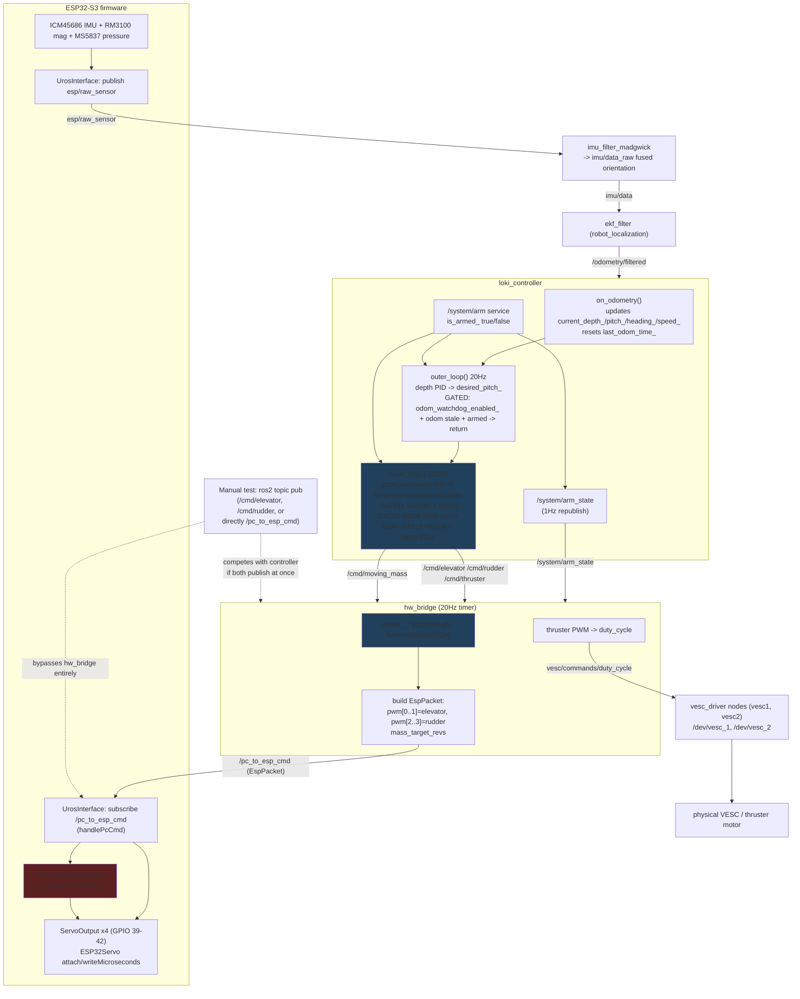

```mermaid
flowchart TD
    subgraph ESP32["ESP32-S3 firmware"]
        IMU["ICM45686 IMU + RM3100 mag + MS5837 pressure"]
        RawPub["UrosInterface: publish esp/raw_sensor"]
        PcSub["UrosInterface: subscribe /pc_to_esp_cmd\n(handlePcCmd)"]
        Servos["ServoOutput x4 (GPIO 39-42)\nESP32Servo attach/writeMicroseconds"]
        Failsafe["2s command timeout\n-> neutral if no packet"]

        IMU --> RawPub
        PcSub --> Servos
        PcSub --> Failsafe
        Failsafe --> Servos
    end

    RawPub -->|"esp/raw_sensor"| IMUFilter["imu_filter_madgwick\n-> imu/data_raw fused orientation"]
    IMUFilter -->|"imu/data"| EKF["ekf_filter (robot_localization)"]
    EKF -->|"/odometry/filtered"| Controller

    subgraph Controller["loki_controller"]
        OdomSub["on_odometry()\nupdates current_depth_/pitch_/heading_/speed_\nresets last_odom_time_"]
        ArmSrv["/system/arm service\nis_armed_ true/false"]
        ArmPub["/system/arm_state\n(1Hz republish)"]

        OuterLoop["outer_loop() 20Hz\ndepth PID -> desired_pitch_\nGATED: odom_watchdog_enabled_ + odom stale + armed -> return"]
        InnerLoop["inner_loop() 100Hz\npitch/yaw/speed PID -> /cmd/thruster,elevator,rudder\nGATED: !armed -> return\nGATED (NEW FIX): odom stale -> force neutral + reset PIDs"]

        OdomSub --> OuterLoop
        OuterLoop --> InnerLoop
        ArmSrv --> ArmPub
        ArmSrv --> OuterLoop
        ArmSrv --> InnerLoop
    end

    ArmPub -->|"/system/arm_state"| HwBridge
    InnerLoop -->|"/cmd/elevator /cmd/rudder /cmd/thruster"| HwBridge
    InnerLoop -->|"/cmd/moving_mass"| HwBridge

    subgraph HwBridge["hw_bridge (20Hz timer)"]
        ArmGate["armed_ ? passthrough : force neutral(1500)/0"]
        BuildPkt["build EspPacket:\npwm[0..1]=elevator, pwm[2..3]=rudder\nmass_target_revs"]
        DutyConv["thruster PWM -> duty_cycle"]

        ArmGate --> BuildPkt
    end

    BuildPkt -->|"/pc_to_esp_cmd (EspPacket)"| PcSub
    DutyConv -->|"vesc/commands/duty_cycle"| VescDriver["vesc_driver nodes (vesc1, vesc2)\n/dev/vesc_1, /dev/vesc_2"]
    VescDriver --> Thruster["physical VESC / thruster motor"]

    Manual["Manual test: ros2 topic pub\n(/cmd/elevator, /cmd/rudder, or\ndirectly /pc_to_esp_cmd)"] -.->|"competes with controller\nif both publish at once"| HwBridge
    Manual -.->|"bypasses hw_bridge entirely"| PcSub

    style Failsafe fill:#5b2020
    style InnerLoop fill:#20405b
    style ArmGate fill:#20405b
```
