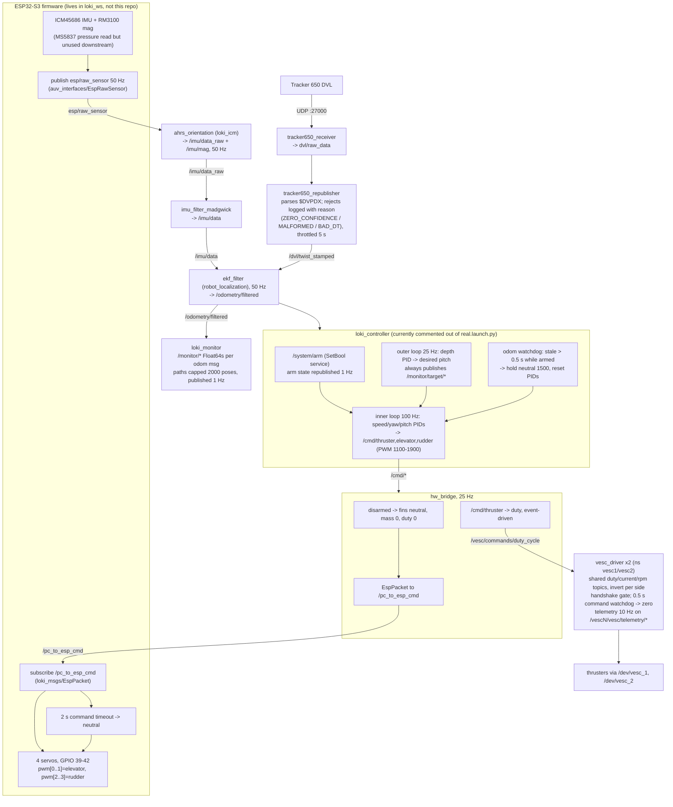

# Loki AUV dataflow

Rates and gating verified against the code on 2026-07-05. If you change a
rate, watchdog, or topic, update this file — a stale diagram is worse than none.

## Safety chain (independent layers)

| Layer | Trips after | Action |
|---|---|---|
| controller odom watchdog | 0.5 s without `/odometry/filtered` | `/cmd/*` -> 1500, PIDs reset |
| hw_bridge arm gate | disarmed (default) | fins neutral, mass 0, duty 0 |
| VESC command watchdog | 0.5 s without a command | thruster zeroed |
| VESC current/RPM backstop | telemetry over `max_current_a` / `max_rpm` | thruster zeroed |
| ESP32 firmware failsafe | 2 s without `/pc_to_esp_cmd` | servos neutral |
