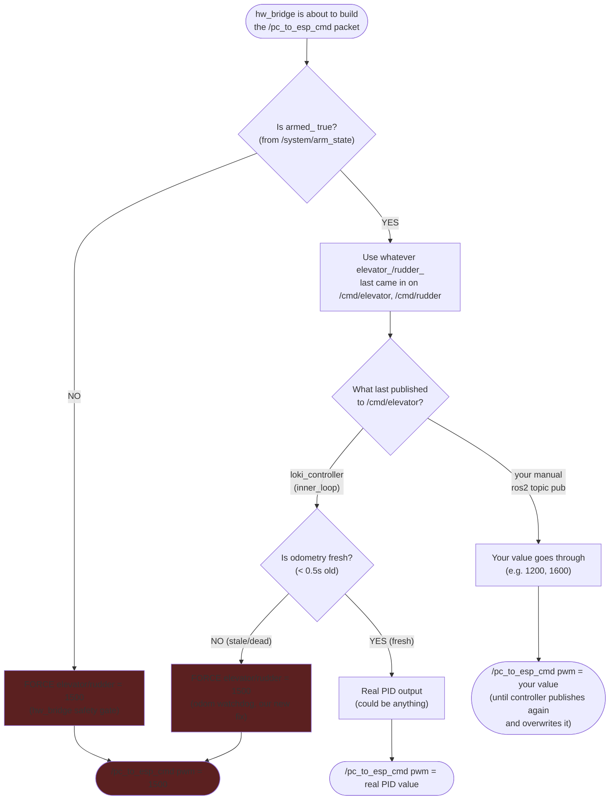

**Plain-English version:**

`/pc_to_esp_cmd` gets stuck at 1500 for one of two reasons, checked in this order:

1. **Not armed.** `hw_bridge` refuses to send anything but neutral unless `/system/arm_state` says `true`. Check with:
   ```bash
   pixi run ros2 topic echo /system/arm_state --once
   ```

2. **Armed, but odometry is dead.** Even when armed, if `loki_controller` is the one driving `/cmd/elevator` (not your manual test), it now forces neutral whenever odometry is older than 0.5s — because your IMU data still isn't flowing (the ESP32/VESC USB port collision from earlier). This is the fix we just added; it's supposed to force 1500 in this case.

If you manually publish to `/cmd/elevator` or directly to `/pc_to_esp_cmd`, your value only "sticks" until the next thing publishes and overwrites it — `hw_bridge` and `loki_controller` don't know or care that you sent a manual value, they just keep running on their own timers.
